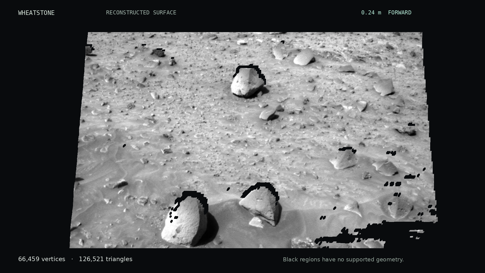

# Mars Stereo

Spirit Navcam stereo reconstruction. Sol 767, 1 March 2006.

[Explore recorded results](https://dicnunz.github.io/demos/mars-stereo/)

[Video](demo/wheatstone.mp4) · [Mesh](output/terrain.obj) · [Measurements](output/metrics.json)



## Inspect locally

Open [web/index.html](web/index.html) in a browser; no installation is needed. To check the saved assets and controls:

```sh
python3 scripts/verify_web.py
node tests/web_controls.cjs
```

## Run

Linux, Python 3.12 and FFmpeg, including `ffprobe`.

```sh
python -m venv .venv
source .venv/bin/activate
pip install -r requirements.txt
python scripts/fetch_data.py
python scripts/reconstruct.py
python scripts/render.py
python scripts/verify.py
```

Keep `terrain.obj`, `terrain.mtl` and `left.png` together. Mesh coordinates: x right, y down, z forward; metres. The PLY uses the source rover frame.

602,875 accepted pixels; 66,459 vertices; 126,521 triangles. Median forward depth: 4.05 m. Median left–right cycle error: 0.0625 px. Absolute terrain accuracy is unvalidated. Occlusions and rejected matches leave gaps. [Method and limitations](docs/method.md).

## Sources

- PDS EDR: [left](https://planetarydata.jpl.nasa.gov/img/data/mer/mer2no_0xxx/data/sol0767/edr/2n194463440effapa0p0685l0m1.img), [right](https://planetarydata.jpl.nasa.gov/img/data/mer/mer2no_0xxx/data/sol0767/edr/2n194463440effapa0p0685r0m1.img). [Checksums](data/provenance.json).
- Maki et al. (2003), [Mars Exploration Rover Engineering Cameras](https://www-robotics.jpl.nasa.gov/media/documents/maki-jgr-2003je002077.pdf), §5.1 and Figs. 25–27. Camera geometry and figure presentation.
- [Ames Stereo Pipeline: Mars Exploration Rovers](https://stereopipeline.readthedocs.io/en/stable/examples/mer.html). CAHVOR stereo reference; this implementation uses OpenCV.

Code: [MIT](LICENSE). Imagery: NASA/JPL-Caltech. [Data terms](data/NOTICE.md).
